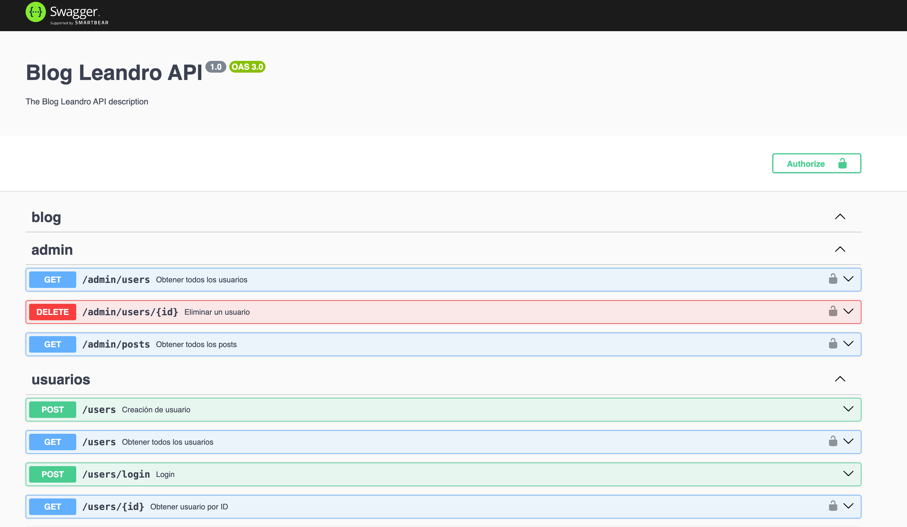

<div align="center">
     
    <h1>📘 El Blog de Leandro - Backend API</h1>
    <p>Este proyecto representa el backend de "El Blog de Leandro", diseñado como una API RESTful que puede ser consumida por aplicaciones frontend. Es el resultado de mi proyecto final en el Bootcamp de JavaScript en el Backend de Código Facilito. Este backend maneja la autenticación, la gestión de usuarios y posts, y ofrece funcionalidades específicas de administración.</p>
</div>

## 📋 Tabla de Contenidos
- [🏗️ Arquitectura y Tecnologías](#-arquitectura-y-tecnologías)
- [🌍 Disponibilidad del Backend API](#disponibilidad-del-backend-api)
- [⚙️ Configuración de Entorno y Requisitos](#️-configuración-de-entorno-y-requisitos)
- [🚀 Empezar](#-empezar)
- [📘 Documentación Swagger](#-documentación-swagger)
- [🌟 Ejemplos de Uso](#-ejemplos-de-uso)
- [🔒 Autenticación y Autorización](#-autenticación-y-autorización)
- [🚀 Acceso de Administrador](#-acceso-de-administrador)
- [📦 Conexión a la Base de Datos MongoDB](#-conexión-a-la-base-de-datos-mongodb)
- [🧪 Testing](#-testing)

## 🏗️ Arquitectura y Tecnologías

- **NestJS**: Un framework progresivo de Node.js para construir aplicaciones de servidor eficientes y escalables, con un enfoque en la modularidad y la reutilización de código.
- **MongoDB**: Como base de datos para almacenar usuarios y posts, aprovechando su flexibilidad y rendimiento en el manejo de datos en formato JSON.
- **JWT (JSON Web Tokens)**: Utilizado para la autenticación y autorización de usuarios, garantizando la seguridad y la integridad de las sesiones de usuario.

## 🌐 Acceso en Línea a "El Blog de Leandro"

### Disponibilidad del Backend API

El backend de "El Blog de Leandro" está disponible online y deployado a un servidor (Render), ofreciendo un entorno de producción listo para usar. Este acceso simplifica la interacción con la API, eliminando la necesidad de una configuración local.

**Accede al Proyecto en Vivo:**
Para explorar la API en funcionamiento, visita: [El Blog de Leandro - Backend API en Vivo](https://blog-leandro.onrender.com/).

### Documentación Disponible en el Servidor

**Accede a la Documentación en Vivo:**
Para una guía detallada y ejemplos de uso de la API, consultar la documentación en: [El Blog de Leandro - Documentación](https://blog-leandro.onrender.com/api). Aquí encontrarás información completa y actualizada para aprovechar al máximo las capacidades de la API.


## ⚙️ Configuración de Entorno y Requisitos

Para poner en marcha el proyecto de manera local, es necesario tener instaladas ciertas herramientas y configurar adecuadamente el entorno de desarrollo. A continuación, se detallan los pasos y requisitos necesarios:

### Requisitos previos

- **Node.js**: Versión 16.x o superior. Node.js es esencial para ejecutar el código del servidor. Puedes descargarlo e instalarlo desde [aquí](https://nodejs.org/).

### Configuración del Archivo `.env`

El proyecto utiliza variables de entorno para gestionar configuraciones sensibles. Debes crear un archivo `.env` en la raíz del proyecto con las siguientes variables:

`JWT_SECRET=tu_clave_secreta_aquí`

Reemplaza `tu_clave_secreta_aquí` con una clave secreta segura. Utiliza un generador de claves o crea una cadena aleatoria larga y compleja. **Evita usar claves de ejemplo en un entorno de producción.**


### Iniciar el Proyecto

Una vez que hayas configurado el entorno y los requisitos previos, sigue las instrucciones en la sección [🚀 Empezar](#-empezar) para clonar el repositorio e iniciar el servidor de desarrollo.


## 🚀 Empezar

1. **Clonar el repositorio:**

    ```bash
    git clone https://github.com/darthdoppel/blog-app.git
    ```

2. **Instalar las dependencias:**

    ```bash
    npm install
    ```

3. **Ejecutar el servidor de desarrollo:**

    ```bash
    npm run start:dev
    ```


## 📘 Documentación Swagger

Aquí puedes ver una captura de pantalla de la documentación de Swagger, que ofrece una descripción detallada de todos los endpoints de la API:

<div align="center">
    
</div>


Para acceder a esta documentación completa, visita: [http://localhost:3000/api](http://localhost:3000/api).

## 🌟 Ejemplos de Uso

Para ejemplos prácticos de cómo interactuar con la API, consulta la documentación de Swagger mencionada anteriormente. Allí encontrarás ejemplos específicos para cada endpoint, que te ayudarán a entender cómo realizar peticiones y qué respuestas esperar.

## 🔒 Autenticación y Autorización

El sistema utiliza JWT para la autenticación y autorización de los usuarios. Los tokens se obtienen al iniciar sesión y deben incluirse en las solicitudes a los endpoints protegidos. Para más detalles sobre cómo usar estos tokens, consulta la documentación de Swagger.

## 🚀 Acceso de Administrador

Para facilitar las pruebas y la demostración, el siguiente conjunto de credenciales puede utilizarse para acceder al sistema con privilegios de administrador:

### 🔑 Credenciales de Administrador para pruebas

```json
POST http://localhost:3000/users/login
Content-Type: application/json

{
    "username": "Admin",
    "password": "12341234"
}
```

Te responderá con un token, que luego se puede utilizar para las pruebas de Administrador. Igualmente, es posible crear un usuario Administrador facilitando el booleano 'isAdmin' como true, al crear un nuevo usuario.

## 📦 Conexión a la Base de Datos MongoDB

Este proyecto se conecta a una base de datos MongoDB preconfigurada. La cadena de conexión está incorporada en el código del proyecto, lo que elimina la necesidad de configuraciones adicionales para la conexión con la base de datos.

### 🔗 Uso de la Base de Datos Preconfigurada

Para utilizar esta base de datos:

1. **No es necesario configurar la cadena de conexión:**
   - La cadena de conexión para acceder a la base de datos ya está establecida en el `AppModule` del proyecto. No es necesario realizar ninguna configuración adicional para conectar con la base de datos.

2. **Acceso directo a la Base de Datos:**
   - Al iniciar el servidor de desarrollo, la aplicación se conectará automáticamente a la base de datos MongoDB configurada.

3. **Manejo de datos:**
   - Se pueden utilizar los endpoints proporcionados por la API para interactuar con la base de datos (crear, leer, actualizar, eliminar datos).

## 🧪 Testing

Las pruebas automatizadas implementadas en este proyecto son principalmente pruebas e2e, diseñadas para simular escenarios de uso reales y probar la API en su conjunto. Para su utilización, correr el comando `npm test`.